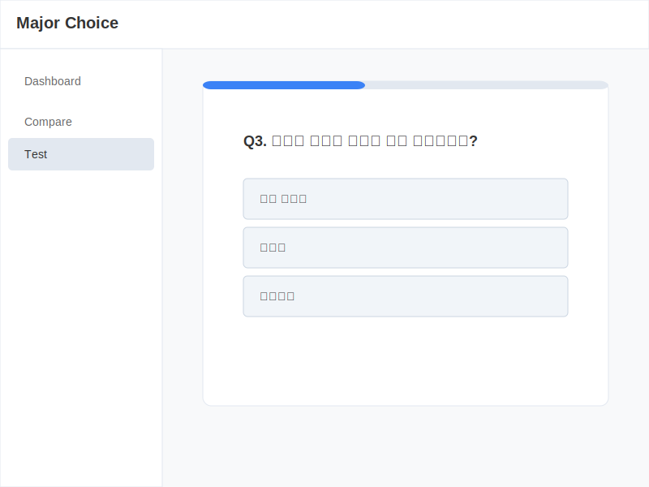
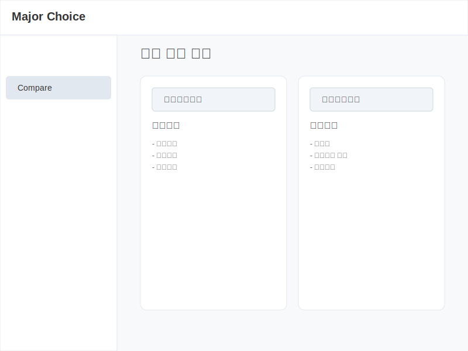

# [프로토타입] 전공 선택 도우미 (Major Choice Helper) 개발 결과 보고서

## 1. 문서 개요
본 문서는 '전공 선택 도우미' 웹 서비스의 프로토타입 개발 결과를 기술한다. 기획 단계에서 정의된 요구사항이 실제 웹 환경에서 어떻게 구현되었는지 확인하고, 핵심 기능의 작동 방식과 기술적 특징을 설명한다.

- **프로젝트명**: 전공 선택 도우미 (Major Choice Helper)
- **개발 기간**: 2025.12 (기말 프로젝트)
- **개발 방식**: AI 협업 개발 (Vibe Coding)
- **문서 버전**: v1.1 (Final Prototype)

---

## 2. 프로토타입 개발 목표 및 범위
### 2.1 개발 목표
- **핵심 기능 검증**: 전공 적성 검사 알고리즘 및 결과 도출 로직의 정상 작동 확인.
- **UX/UI 시연**: 실제 사용자가 경험하게 될 인터페이스와 인터랙션(화면 전환, 애니메이션 등) 구현.
- **데이터 흐름 확인**: 사용자 입력 데이터가 로컬 환경에서 어떻게 저장되고 활용되는지 검증.

### 2.2 구현 범위
| 구분 | 기능 | 구현 상태 | 비고 |
|:---:|:---|:---:|:---|
| **핵심** | 전공 적성 검사 | ✅ 구현 완료 | 가중치 알고리즘 적용, 결과 도출 |
| **핵심** | 전공 비교 분석 | ✅ 구현 완료 | 동적 데이터 렌더링 |
| **핵심** | 학습 로드맵 | ✅ 구현 완료 | 타임라인 UI 시각화 |
| **보조** | 대시보드 | ✅ 구현 완료 | 차트 시각화, 진행률 표시 |
| **보조** | 회원가입/로그인 | ⚠️ 모의 구현 | `localStorage` 기반 세션 시뮬레이션 |
| **보조** | FAQ | ✅ 구현 완료 | 아코디언 UI 및 검색 |

---

## 3. 시스템 아키텍처
### 3.1 기술 스택 (Tech Stack)
본 프로토타입은 별도의 백엔드 서버 없이 웹 브라우저만으로 구동되도록 설계됨.
- **Frontend**: HTML5, CSS3, Vanilla JavaScript (ES6+)
- **Storage**: Browser LocalStorage (DB 대체)
- **Design System**: CSS Variables 기반의 다크/라이트 모드 대응 구조 (현재 다크 테마 적용)

### 3.2 데이터 흐름도 (Data Flow)
1. **사용자 진입** (`index.html`) → 로그인 여부 확인 (`localStorage` 체크)
2. **적성 검사** (`test.html`) → 문항 응답 → 점수 계산 → `localStorage`에 결과 저장
3. **결과 확인** (`index.html`) → 저장된 점수 로드 → `Chart.js` 없이 CSS/JS로 차트 렌더링
4. **정보 탐색** (`compare.html`, `roadmap.html`) → 정적 데이터(JSON 형태의 JS 객체) 로드 및 표시

---

## 4. 주요 기능 상세 구현 내용

### 4.1 대시보드 (Dashboard)
- **파일**: `index.html`, `app.js`
- **화면 예시**:
  > 
  > *[그림 1] 사용자의 적성 검사 결과와 진행률을 보여주는 메인 대시보드*
- **특징**:
  - 사용자의 활동 내역을 종합적으로 보여주는 관제 센터 역할.
  - **Ring Chart**: CSS `conic-gradient`를 활용하여 테스트 진행률을 시각적으로 표현.
  - **Bar Chart**: 외부 라이브러리 없이 `div` 요소의 높이 조절만으로 적성 분포 그래프 구현.

### 4.2 전공 적성 검사 (Aptitude Test)
- **파일**: `test.html`, `test.js`
- **화면 예시**:
  > 
  > *[그림 2] 사용자 성향 파악을 위한 객관식 테스트 진행 화면*
- **로직**:
  - 총 12개 문항, 각 문항은 '개발/구현' vs '보안/분석' 성향 점수 매핑.
  - 답변 선택 시 즉시 다음 문항으로 넘어가는 부드러운 UX 제공.
  - 완료 시 점수를 합산하여 '추천 전공'을 결정하고 저장소에 기록.

### 4.3 전공 비교 (Major Comparison)
- **파일**: `compare.html`, `compare.js`
- **화면 예시**:
  > 
  > *[그림 3] 두 전공의 커리큘럼과 진로를 비교하는 화면*
- **UI**:
  - 화면을 좌우로 분할(Split View)하여 두 전공의 커리큘럼과 진로를 직관적으로 비교.
  - 드롭다운 변경 시 `change` 이벤트를 감지하여 내용을 즉시 업데이트(DOM Manipulation).

### 4.4 학습 로드맵 (Roadmap)
- **파일**: `roadmap.html`, `roadmap.js`
- **화면 예시**:
  > 
  > *[그림 4] 학년별 이수 과목과 활동을 보여주는 타임라인*
- **UI**:
  - 수직 타임라인(Vertical Timeline) 디자인 적용.
  - 각 학년/학기별 주요 이벤트를 시간 순서대로 배치하여 성장 경로 시각화.

### 4.5 회원 시스템 (Auth System)
- **파일**: `login.html`, `signup.html`, `login.js`, `signup.js`
- **화면 예시**:
  >  
  > *[그림 5] 사용자 인증을 위한 로그인 화면*
- **구현 방식**:
  - 실제 서버 통신은 없으나, `localStorage`에 사용자 정보를 JSON 문자열로 저장하여 회원가입/로그인 프로세스를 완벽하게 흉내냄(Mocking).
  - 로그인 상태에 따라 상단 네비게이션 버튼이 'Sign in'에서 'Logout'으로 변경되는 상태 관리 로직 포함.

---

## 5. 프로토타입의 기술적 의의
1. **Zero Dependency**: React나 Vue 같은 프레임워크 없이, 오직 순수 웹 기술(Vanilla JS)만으로 SPA(Single Page Application)와 유사한 사용자 경험을 구현.
2. **Client-Side Persistence**: 서버 없이도 사용자의 데이터(테스트 결과, 로그인 상태)가 브라우저를 닫았다 켜도 유지되도록 구현하여, 실제 서비스와 유사한 경험을 제공.
3. **AI Collaboration**: 기획 단계부터 코드 구현, 버그 수정까지 AI(ChatGPT)와 협업하여 개발 생산성을 극대화한 '바이브코딩' 사례임.

## 6. 향후 발전 계획
- **백엔드 연동**: Firebase 등을 도입하여 실제 데이터베이스 구축.
- **콘텐츠 보강**: 현재 2개 전공(컴퓨터공학, 정보보호학) 외 타 전공 데이터 추가.
- **모바일 최적화**: 모바일 환경에서의 터치 인터페이스 개선.
